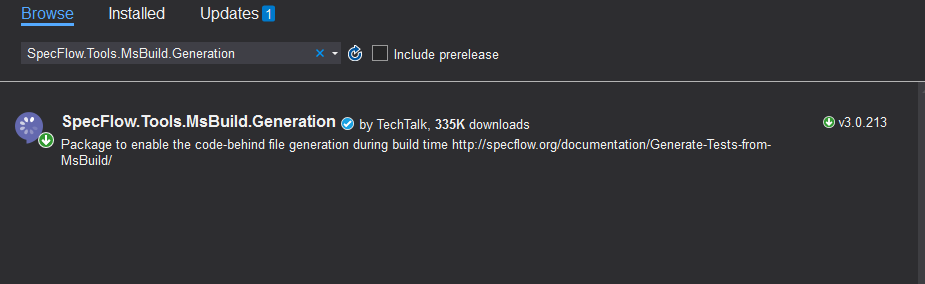
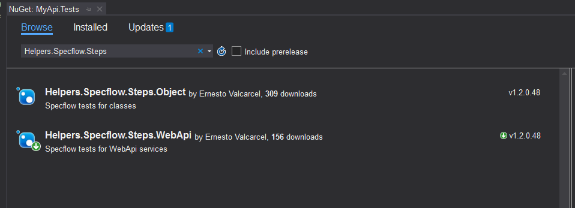
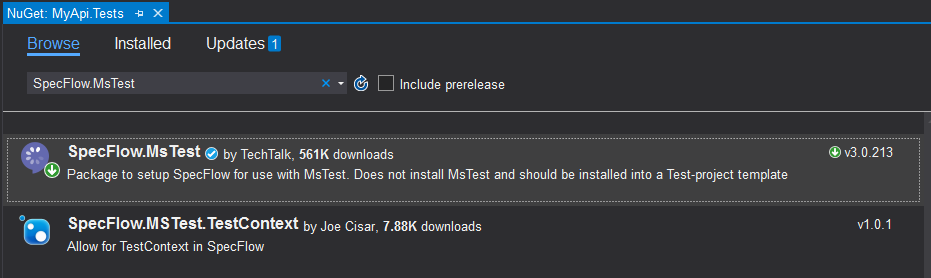
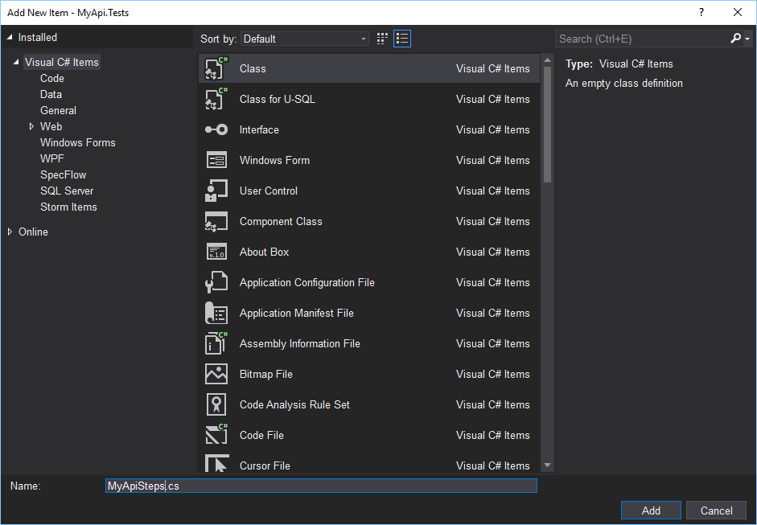
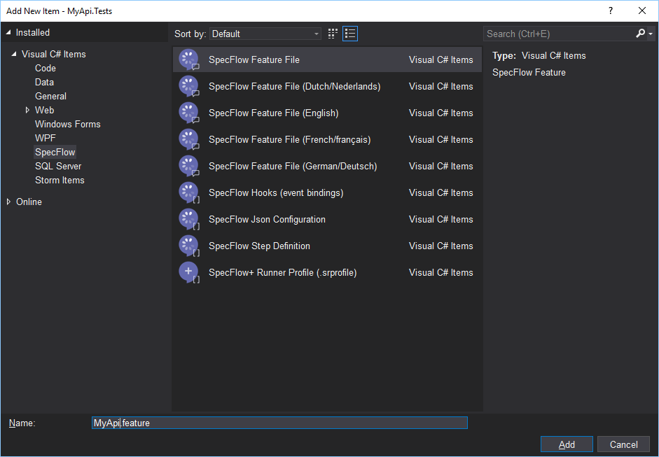
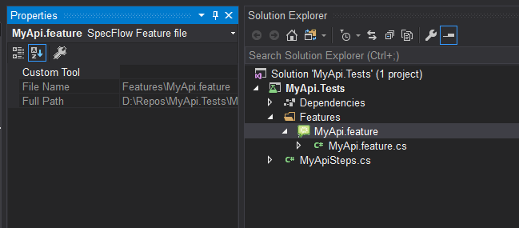
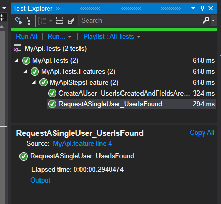
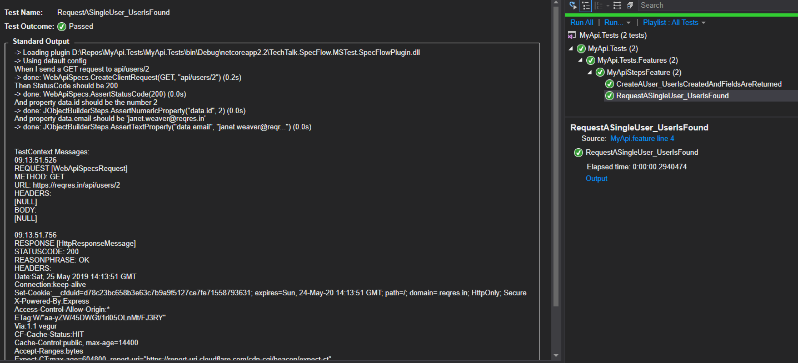

# Getting started

Steps for creating a project for testing a WebApi.

This tutorial uses Visual Studio 2019 Community with the extension SpecFlow for Visual Studio 2019.

To install SpecFlow for Visual Studio 2019 extension select Extensions->Manage Extension menu, search the extension by the name and complete the steps to install it.


1.	Create a new test project in Visual Studio. This tutorial uses a MSTest Test Project  (.NET Core) but it is possible to use other types of test projects.


2.	Enter the name MyApi.Tests for the project.


3.	After the project is created remove the test that was created with the template. UnitTest1.cs.


4.	Add NuGet packages SpecFlow.Tools.MsBuild.Generation, Helpers.Specflow.Steps.WebApi, and SpecFlow.MsTest to the project.







Specflow has different packages for different test frameworks, e.g. SpecFlow.xUnit and SpecFlow.NUnit.


5.	Add a new class called MyApiSteps.cs



Replace the text

```csharp
using Microsoft.VisualStudio.TestTools.UnitTesting;
using Specflow.Steps.WebApi;
using TechTalk.SpecFlow;

namespace MyApi.Tests
{
    [Binding]
    [Scope(Feature = "MyApiSteps")]
    public class MyApiSteps : WebApiSpecs
    {
        private static readonly WebApiSpecsConfig _config = new WebApiSpecsConfig { BaseUrl = "https://reqres.in" };
        public MyApiSteps(TestContext testContext) : base(testContext, _config) { }
    }
}
```


6.	Add a folder called Features to the project


7.	Add a `feature` file. Select Add->New Item on Features folder. Select `SpecFlow Feature File` and enter the name MyApi.feature



Replace the text

```
Feature: MyApiSteps
	A simple test

Scenario: Request a single user - User is found
	When I send a GET request to api/users/2
	Then StatusCode should be 200
	And property data.id should be the number 2
	And property data.email should be 'janet.weaver@reqres.in'

Scenario: Create a user - User is created and fields are returned
	Given property name equals to 'Mario'
	And property job equals to 'Manager'
	When I send a POST request to api/users
	Then StatusCode should be 201
	And property name should be 'Mario'
	And property job should be 'Manager'
	
```


8.	Remove the assigned custom tool for MyApi.feature file. Select the file and press F4 to open the properties for the file, then clear the Custom Tool property.




9.	Build the solution and execute the tests. The two tests should pass.



Use the output of the test to se the details of the request and the response.


