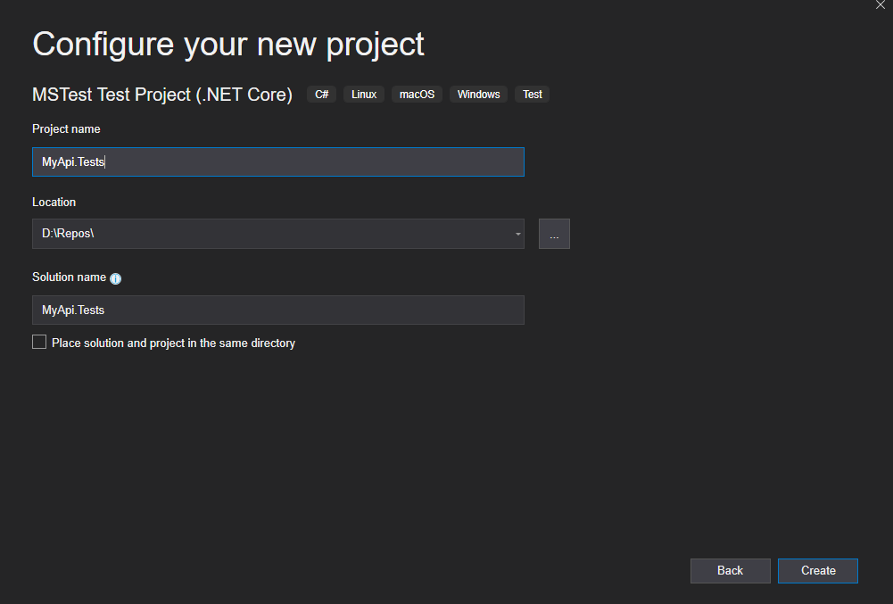

# Getting started

Steps for creating a Test project that uses Specflow tests for testing a WebApi.

This tutorial uses Visual Studio 2019 Community with the extension SpecFlow for Visual Studio 2019.

To install SpecFlow for Visual Studio 2019 extension select Extensions->Manage Extension menu, search the extension by the name and complete the steps to install it.

1.	Create a new test project in Visual Studio. This tutorial uses a MSTest Test Project  (.NET Core) but it is possible to use other types of test projects.

2.	Enter the name MyApi.Tests for the project.

3.	After the project is created remove the test that was created with the template. UnitTest1.cs.

5.	Add NuGet packages SpecFlow.Tools.MsBuild.Generation, Helpers.Specflow.Steps.WebApi, and SpecFlow.MsTest to the project.
